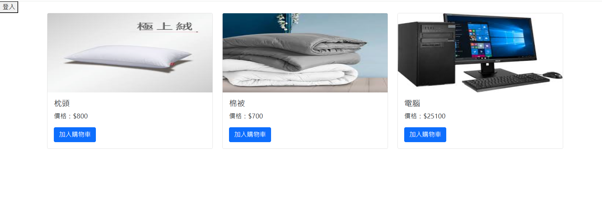
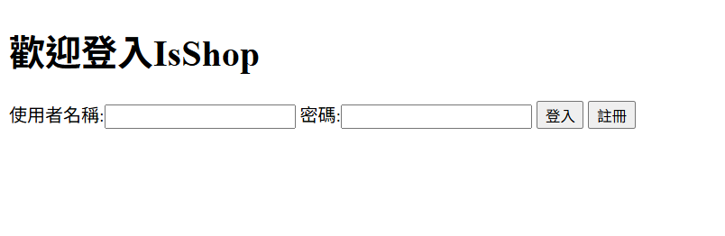
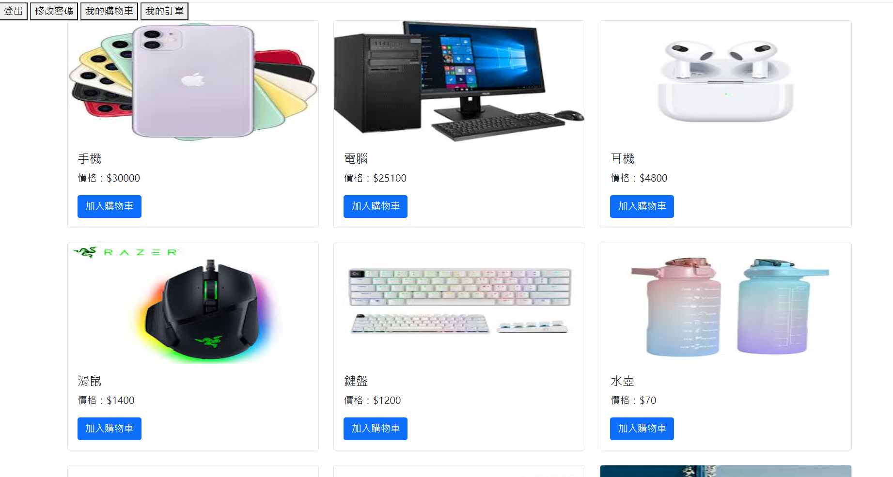
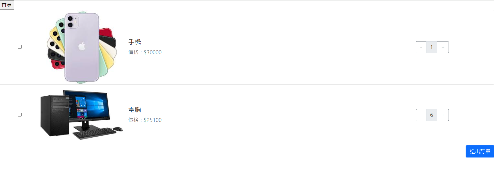
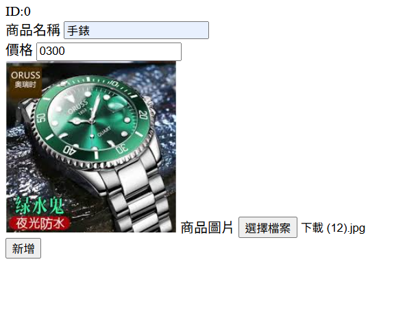

# 專案名稱
電商網站

##  功能
- ✅ 功能一：登入、註冊、用戶資料管理
- ✅ 功能二：商品管理（CRUD）
- ✅ 功能三：購物車與訂單

##  技術架構
- Java + Spring Boot
- Spring Security + JWT
- MSSQL + JPA
- Swagger UI + RESTful API
- Thymeleaf + Ajax
- logback日誌

##  頁面展示
### 首頁

### 登入

### 商品頁

### 購物車

### 上架商品

